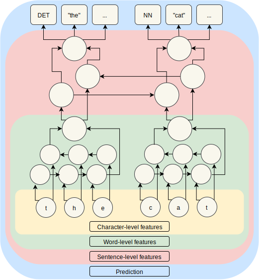
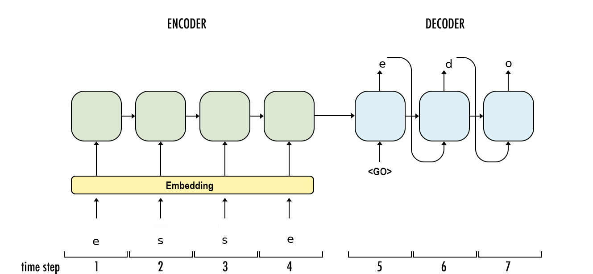

# PIE: A Framework for Joint Learning of Sequence Labeling Tasks

[](https://zenodo.org/badge/latestdoi/131014015)


PIE was primarily conceived to make experimentation on sequence labeling of variation-rich languages easy and user-friendly. PIE has been tested mostly for Lemmatization but other SoTA accuracies from other tasks like POS have been reproduced (cf. Plank et al ). PIE is *highly* configurable both in terms of input preprocessing and model definition, in principle not requiring users to write any code (instead experiments are defined with json files). It is highly modular and therefore easy to extend. It includes transductive lemmatization as an additional sequence labeling task and, finally, it is reasonably fast and memory efficient.

Documentation is work in progress and it will improve over the following months. A good place to learn about its functionality is to check `pie/default_settings.json` which explains all input parameters and shows a full example of a config file (minus input data).

If you find `pie` useful, please use the following reference:

```
@inproceedings{manjavacas-etal-2019-improving,
    title = "Improving Lemmatization of Non-Standard Languages with Joint Learning",
    author = "Manjavacas, Enrique  and
      K{\'a}d{\'a}r, {\'A}kos  and
      Kestemont, Mike",
    booktitle = "Proceedings of the 2019 Conference of the North {A}merican Chapter of the Association for Computational Linguistics: Human Language Technologies, Volume 1 (Long and Short Papers)",
    month = jun,
    year = "2019",
    address = "Minneapolis, Minnesota",
    publisher = "Association for Computational Linguistics",
    url = "https://www.aclweb.org/anthology/N19-1153",
    doi = "10.18653/v1/N19-1153",
    pages = "1493--1503",
    abstract = "Lemmatization of standard languages is concerned with (i) abstracting over morphological differences and (ii) resolving token-lemma ambiguities of inflected words in order to map them to a dictionary headword. In the present paper we aim to improve lemmatization performance on a set of non-standard historical languages in which the difficulty is increased by an additional aspect (iii): spelling variation due to lacking orthographic standards. We approach lemmatization as a string-transduction task with an Encoder-Decoder architecture which we enrich with sentence information using a hierarchical sentence encoder. We show significant improvements over the state-of-the-art by fine-tuning the sentence encodings to jointly optimize a bidirectional language model loss. Crucially, our architecture does not require POS or morphological annotations, which are not always available for historical corpora. Additionally, we also test the proposed model on a set of typologically diverse standard languages showing results on par or better than a model without fine-tuned sentence representations and previous state-of-the-art systems. Finally, to encourage future work on processing of non-standard varieties, we release the dataset of non-standard languages underlying the present study, which is based on openly accessible sources.",
}
```

## 1. Installation

PIE is available from pypi, which means that all you should need to do is:

```bash
pip install nlp-pie
```

### For development

If you are planning to develop on top of PIE, the easiest way is to get setup is to download the repository and install the dependencies (see `requirements.txt`). The only step needed to have `pie` available from any place in the file system is to add the path to `pie` to the `PYTHONPATH` environment variable. There are two ways to accomplish this:

- From your bash init file (depending on your distro and configuration this could be `.bashrc`, `.bash_profile`, `.profile`, etc...):

```bash
export PYTHONPATH="$PYTHONPATH:/path/to/pie"
```

- From your python script, using `sys`:

```python
import sys
sys.path.append('/path/to/pie')
```

## 2. Training

Training models is done with `pie train path/to/config.json` (or script `python pie/scripts/train.py`. All non-nested parameters can be overwritten directly from the command line using environment variables like `PIE_DEVICE=cpu` (for input parameter `device`. Warning: bear in mind that due to the way bash parses environment variables `PIE_...=False` will be parsed into a boolean `True`, which might be counter-intuitive. If you wish to get `False` for a parameter from the command line you can use `PIE_...=""`).

## 3. Evaluation

A given model can be evaluated with `pie evaluate` (or `python pie/scripts/evaluate.py`).

## 4. Tagging

Given one or several trained models, two scripts are provided in order to tag given input: `pie tag` and `pie tag-pipe` (or `python pie/scripts/tag.py`, `python pie/scripts/tag_pipe.py`), the difference being that the first tags input files and the second can take input from a unix pipe.

Common to both scripts is the *model specification* that allows to combine several models, where the output for a particular task is taken from a model that excels at that task.
For example, given models `good-pos-tagger.tar` and `good-lemma-tagger.tar`, we can define a tagger that uses `good-pos-tagger.tar` for POS-tagging and `good-lemma-tagger.tar` for lemmatization with the following specification: `<good-lemma-tagger.tar,lemma><good-pos-tagger.tar,pos>`.

- If your input is in a file `test.txt` (with a sentence per line) you can use:

`pie tag "<good-lemma-tagger.tar,lemma><good-pos-tagger.tar,pos>" test.txt`

and the output will be written to `test.pie.txt`

- If you want to pass input from the command line, you can use:
```
$ echo "el gato duerme encima de la silla" | pie tag-pipe spanish-lemmatizer.rar

token	lemma
el	el
gato	gato
duerme	dormir
encima	encima
de	de
la	el
silla	silla
```

## 5. Model

PIE underlying model comprises a set of hierarchical feature extractors from the character-level up to the sentence-level. For each input token a sentence-level feature vector is extracted and used for the prediction of any number of target tasks (e.g. POS-tagging, lemmatization, ...). A visualization of the underlying model using bidirectional RNNs to extract word-level and sentence-level features is shown below.



Prediction is accomplished with decoder modules. We provide implementations of a `linear` decoder trained to maximize the probability assigned by the model to the corpus data via a softmax function (similar to a MaxEnt classifier). A `crf` decoder, particularly suited for tasks that imply a dependency between neighboring output tags and an `attentional` decoder, suited for tasks that can be solved by generating the token-level output character by characters in a string transduction manner (e.g. lemmatization, normalization).

## 6. Configuration files

Training a model only requires a model specification and paths to training and dev datasets. Pie user interface employs a simple json file (in order to allow in-line comments, we make use of the package `JSON_minify`), an example of which can be seen below:

```json
{
  "modelname": "lemmatization-latin",
  "modelpath": "models",

  "input_path": "datasets/LLCT1/train.tsv",
  "dev_path": "datasets/LLCT1/dev.tsv",
  "sep": "\t",
 
  "tasks": [
    {
      "name": "lemma",
      "target": true,
      "context": "sentence",
      "level": "char",
      "decoder": "attentional",
      "settings": {
        "bos": true,
        "eos": true,
        "lower": true,
        "target": "lemma"
      },
      "layer": -1
    }
  ],
  "batch_size": 25,
  "epochs": 100,
  
  "dropout": 0.25,
  "optimizer": "Adam",
  "patience": 3,
  "lr": 0.001,
  "lr_factor": 0.75,
  "lr_patience": 2,
  
  "cell": "GRU",
  "num_layers": 1,
  "hidden_size": 150,
  "wemb_dim": 0,
  "cemb_dim": 300,
  "cemb_type": "rnn",
  "cemb_layers": 2
}
```

The very minimum set of options required to train a model includes `input_path` (path to files with training data), `dev_path` (path to files with development data), and `tasks`, which defines the model to be trained. Other parameters refer to model hyperparameters (`cell`, `num_layers`, `hidden_size`, `wemb_dim`, `cemb_dim`, `cemb_type`, `cemb_layers`), training (`batch_size`, `epochs`) and optimization (`dropout`, `optimizer`, `patience`, `lr`, `lr_factor`, `lr_patience).

### POS tagging using a CRF

```json
{
  "tasks": [
    {
      "name": "pos", 
      "target": true,
      "decoder": "crf",
      "layer": -1
    }
  ]
}

```

### POS tagging using a linear decoder and 2 auxiliary tasks
```json
{
  "tasks": [
    {
      "name": "pos",
      "level": "token",
      "target": true,
      "decoder": "crf",
      "layer": -1,
      "schedule": {
        "patience": 3
      }
    },
    {
      "name": "case",
      "level": "token",
      "target": false,
      "decoder": "linear",
      "layer": 0,
      "schedule": {
        "patience": 2,
        "factor": 0.5
      }
    },
    {
      "name": "number",
      "level": "token",
      "target": false,
      "decoder": "linear",
      "layer": 0,
      "schedule": {
        "patience": 2,
        "factor": 0.5
      }
    }
  ]
}
```

By setting a schedule we can fine-tune the learning dynamics of auxiliary tasks in a multi-task settings (see below for more information on this). 

To avoid verbosity, parameters invariant across auxiliary tasks can be specified only once using `task_defaults`. Similarly, learning schedule parameters invariant across tasks (`factor`, `patience`, `threshold`, `min_weight`) can be factored out of the task schedule definition. In summary, the previous configuration can be rewritten in the following form:

```json
{
  "tasks": [
    {
      "name": "pos",
      "level": "token",
      "target": true,
      "decoder": "crf",
      "layer": -1,
      "schedule": {
        "patience": 3
      }
    },
    {
      "name": "case"
    },
    {
      "name": "number"
    }
  ],
  "task_defaults": {
    "level": "token",
    "decoder": "linear",
    "layer": 0
  },
  "patience": 2,
  "factor": 0.5
}

```

### Transduction-based lemmatization

PIE has built-in support for lemmatization as a string transduction task using an Encoder-Decoder architecture as shown below (lemmatizing Latin token "esse" to its lemma "edo"):



PIE implements several state-of-the-art attention mechanisms to faciliate information flow between the encoder and the decoder. Additionally, the decoder can be conditioned on sentence-level features to help with disambiguating.

A task configuration for lemmatization with an Encoder-Decoder model and integrated sentence-level features is shown below.

```json
{
  "tasks": [
    {
      "name": "lemma",
      "level": "char",
      "target": true,
      "decoder": "attentional",
      "context": "sentence",
      "layer": -1,
      "schedule": {
        "patience": 3
      }
    }
  ]
}
```

## 7. Improving feature extraction with a joint Language Model loss

Pie has a built-in option to improve feature extraction by predicting neighboring words from the sentence-level feature vectors. The mechanism has been thoroughly tested for lemmatization in research currently submitted to review and it has been shown to be very effective for languages without a fixed writing standard (e.g. historical languages) and other languages with high token-lemma ambiguity. Besides, there is nothing in theory opposing the idea that it might help with other tasks such as POS-tagging, morphological analyses, etc...  The options affecting the joint LM-loss are: `include_lm` (switch on the option), `lm_shared_softmax` (whether to share parameters between forward and backward LMs, recommended value: `true`), `lm_schedule` (parameters to lower the weight assigned to the LM loss over training, once the LM loss starts overfitting it is a good idea to start reducing the loss and eventually set it to 0 to avoid affecting the learning of the target task).

## 8. Multi-task learning

When more than one task is defined, at least and at most one task has to have the key-value pair `"target": true`, denoting that that's the task we ultimately care about. All the other tasks will be treated as auxiliary tasks with the goal of extracting better features for the target task. Note that in any case the model will still be able to predict output for auxiliary tasks, but in the spirit of multi-task learning, you will prefer to train a separate model for each of the tasks you care about, selecting each time the appropriate target task and letting all other tasks help the optimization. In the end, you have as many models as tasks you care about, each of which has been optimized for the respective task.

### More on auxiliary tasks

An auxiliary task might help learning better features that the classifier for the target task can exploit to produce better (in terms of classification performance) and more robust output (less susceptible to spurious correlations). However, training dynamics in a multi-task setting are complex (even more so than in a normal setting), since different tasks usually results in different learning curves that have to be monitored. In particular, if an auxiliary task converges before the target task, further training might lead that auxiliary task towards overfitting, thereby undoing the potential work done so far. Moreover, losses from different tasks are usually in different scales and this might have the effect that an auxiliary task with a loss on a higher scale dominates training.

In order to avoid it, the strategy chosen for PIE consists on set learning schedules for tasks (similar to early stopping) that decrease the weights given to particular tasks over time based on development performance. 

Multi-task learning consists on jointly training a model for different tasks while sharing parts of the general architecture for all tasks. This can be accomplished by either computing the loss for all tasks every batch and aggregating it before the backward pass, or optimizing in each batch for a single task randomly sampled based on a particular distribution. PIE follows the latter setting, which is known to produce better results.

Additionally, it is also important, in case of a multi-layer sentence-level feature extractor, to select at what layer a particular task can help the most (this can be controlled with the "layer" option).

Finally, multi-task learning is far from being a silver bullet and it is an empirical question whether a multi-task learning setup will yield improvements. It is recommended to first train a single model, and then try different multi-task learning configuration to see if improvements can be achieved.
